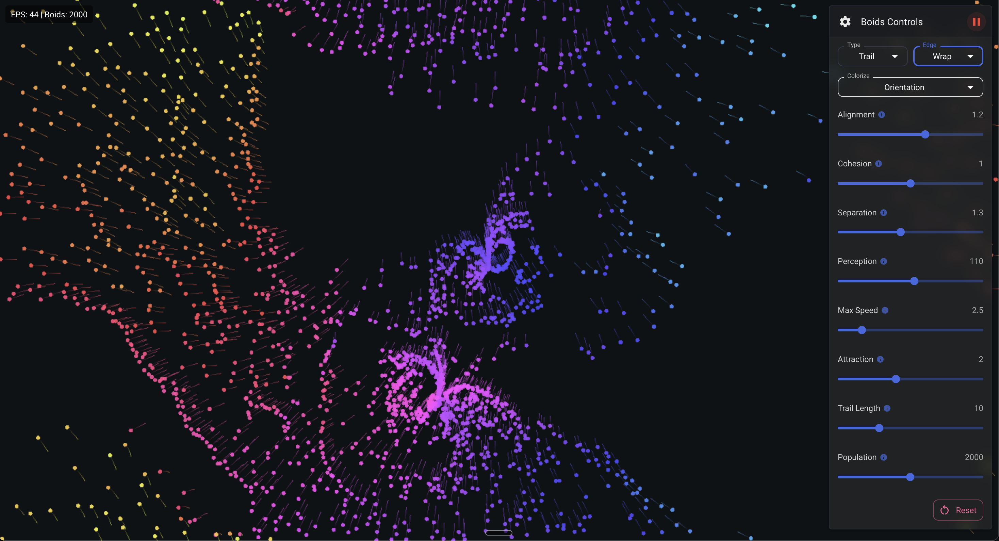

# Boids Flocking Simulation

An interactive implementation of Craig Reynolds' Boids flocking algorithm with WebGL rendering and real-time controls.

## Live Demo

Check out the live demo at [https://neovand.github.io/boids/](https://neovand.github.io/boids/)




## Overview

This project simulates the emergent flocking behavior of birds (boids) using simple rules:
- **Separation**: Avoid crowding neighbors
- **Alignment**: Steer towards the average heading of neighbors
- **Cohesion**: Steer towards the average position of neighbors

The simulation features spatial partitioning for performance optimization, allowing thousands of boids to be simulated in real-time.

## Features

- **High-performance WebGL rendering** with Canvas2D fallback
- **Interactive controls** to adjust simulation parameters in real-time
- **Mouse/touch interaction** to attract boids to cursor position
- **Multiple particle types**: disk, dot, and trail visualizations
- **Dynamic colorization modes** based on speed, orientation, neighbors, and more
- **Optimized with spatial partitioning** for O(n) instead of O(n²) performance
- **Responsive design** that works on desktop and mobile devices
- **Edge behaviors**: wrap, bounce, or avoid
- **Adjustable parameters**:
  - Alignment force
  - Cohesion force
  - Separation force
  - Perception radius
  - Maximum speed
  - Attraction force
  - Trail length
  - Population size

## Technical Stack

- **React** with functional components and hooks
- **TypeScript** for type safety
- **WebGL** for high-performance rendering
- **Material UI** for the control interface
- **Vite** for fast development and building

## Installation

```bash
# Clone the repository
git clone https://github.com/neovand/boids.git
cd boids

# Install dependencies
npm install

# Start the development server
npm run dev
```

## Usage

1. Open the application in your browser (default: http://localhost:5173)
2. Use the control panel on the right to adjust simulation parameters
3. Click and drag on the canvas to attract boids to your cursor
4. Experiment with different particle types and edge behaviors
5. Adjust parameters to observe different flocking patterns

## Controls

- **Type**: Choose between disk, dot, or trail visualization
- **Edge**: Select wrap, bounce, or avoid behavior at simulation boundaries
- **Colorize**: Select coloring mode (default, speed, orientation, random, neighbors)
- **Alignment**: How strongly boids align with neighbors
- **Cohesion**: How strongly boids are attracted to flock center
- **Separation**: How strongly boids avoid neighbors
- **Perception**: How far each boid can see
- **Max Speed**: Maximum velocity of boids
- **Attraction**: Strength of attraction to cursor when clicked
- **Trail Length**: Length of trail when using trail visualization
- **Population**: Number of boids to simulate
- **Reset**: Reset the simulation with current settings

## Colorization Modes

- **Default**: Uses a preset color palette based on boid ID
- **Speed**: Colors boids from blue (slow) to red (fast) based on velocity
- **Orientation**: Colors boids based on their direction of movement
- **Random**: Assigns consistent random colors based on boid ID
- **Neighbors**: Colors boids based on how many neighbors they have (blue for few, red for many)

## How It Works

The simulation implements Craig Reynolds' Boids algorithm with modern optimizations:

1. **Spatial Partitioning**: The simulation space is divided into a grid, allowing boids to only check nearby cells for neighbors, dramatically improving performance.

2. **WebGL Rendering**: Custom shaders provide high-performance rendering, with Canvas2D fallback for compatibility.

3. **State Management**: React hooks manage the simulation state, with efficient updates to prevent unnecessary re-renders.

4. **Vector Math**: Custom vector operations handle the physics calculations for boid movement.

## Project Structure

```
src/
├── components/
│   ├── boids/
│   │   ├── BoidsCanvas.tsx    # WebGL/Canvas rendering
│   │   └── BoidsSimulation.tsx # Main simulation component
│   └── controls/
│       └── BoidsControls.tsx  # UI controls
├── utils/
│   └── boids.ts              # Boids algorithm implementation
└── App.tsx                   # Main application entry
```

## Performance Tips

- For best performance, use a device with WebGL support
- Reduce the population size on lower-powered devices
- Trail visualization is more performance-intensive than other types
- Use the colorization modes to better visualize boid behavior

## Credits and Acknowledgments

- Original Boids algorithm by Craig Reynolds: https://www.red3d.com/cwr/boids/
- WebGL shader implementations inspired by various open-source projects
- Built with React, TypeScript, and Material UI

## License

MIT
